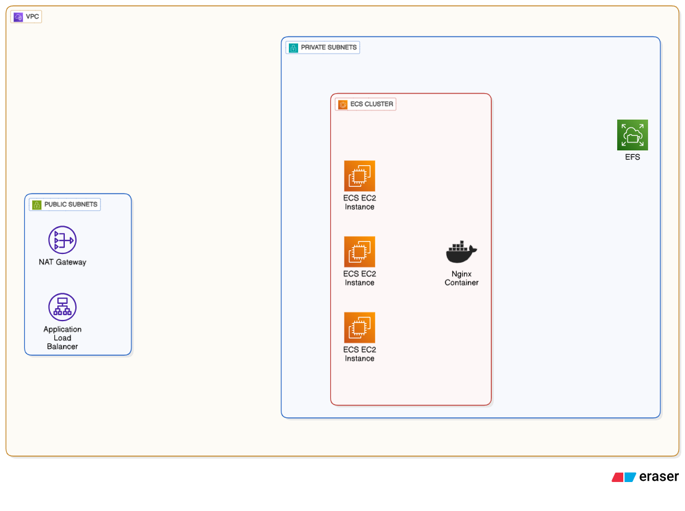

# Terraform ECS EC2 Task Deployment

This repository uses **Terraform** to provision AWS infrastructure and deploy an **Nginx container** using **Amazon ECS (Fargate)**.

## 🚀 Project Overview

### Key Features

* Modularized Terraform structure (VPC & ECS modules)
* Custom VPC with public subnet
* ECS Cluster with Nginx container
* Security group to allow HTTP (port 80)
* Publicly accessible Nginx container

## Architecture Diagram


## 🔐 AWS CLI Configuration

Ensure your CLI is configured with proper credentials:
```bash
aws configure
```
## ⚙️ Deployment Steps

```bash
# Step 1: Initialize Terraform
terraform init

# Step 2: Preview the execution plan
terraform plan

# Step 3: Apply and provision the infrastructure
terraform apply
```
## 📦 Provisioned Resources

* **VPC** with subnets
* **ECS Cluster**, Task Definition, and Service
* **Security Group** (HTTP access)
* **Nginx Container** accessible via Public IP

## 🌐 Access

After deployment, access your Nginx container using the public IP.

## 🧹 Cleanup

To destroy all provisioned resources:

```bash
terraform destroy
```


